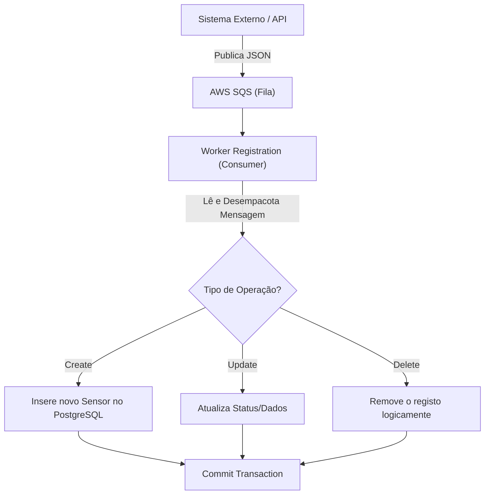
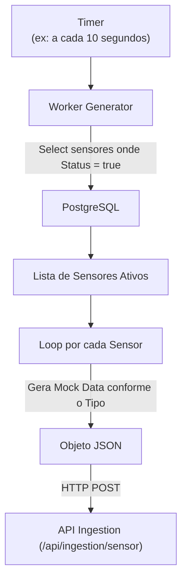

# 🚀 Agrosolutions Worker Sensors

[](https://dotnet.microsoft.com/download/dotnet/10.0)
[](https://aws.amazon.com/sqs/)
[](https://aws.amazon.com/eks/)

`agrosolutions-worker-sensors` é uma solução composta por microsserviços (Workers) que correm em background (segundo plano) para a gestão do ciclo de vida dos sensores agrícolas e simulação contínua de telemetria.

# 🎯 Objetivos

 - Gerir o registo, atualização e remoção lógica de sensores na base de dados relacional.
 - Simular o comportamento de dispositivos IoT no terreno, gerando dados de forma realista e periódica.
 - Garantir a consistência dos metadados através do processamento assíncrono de mensagens.

# 📃 Funcionalidades principais:

 - **Worker de Registo (Registration)**: Consome uma fila do **AWS SQS** (com suporte a envelopes do MassTransit) e executa operações de CRUD (Create, Update, Delete) no PostgreSQL.
 - **Worker Gerador (Generator)**: Serviço executado periodicamente (via Timer) que varre os sensores ativos na base de dados e envia dados simulados diretamente para a API de Ingestão (`POST /api/ingestion/sensor`).
 - **Gestão de Tipos de Sensores**: Suporte a dados específicos para sensores do tipo Solo, Silo e Meteorológica.

# 🗃️ Estrutura da Base de Dados

O worker de registo gere a tabela principal de sensores através de Entity Framework Core Migrations (PostgreSQL).

## 📡 Tabela de Sensores (`Sensors`)

| Coluna | Tipo | Descrição |
| :--- | :--- | :--- |
| SensorID | UUID | ID do sensor |
| FieldId | UUID | ID do talhão/terreno ao qual o sensor pertence. |
| TypeSensor | INT (Enum) | Tipo do sensor (1=Solo, 2=Silo, 3=Meteorológica). |
| StatusSensor | BOOLEAN | Indica se o sensor está ativo a gerar dados. |
| DtCreated | TIMESTAMP | Data de registo do sensor. |
| TypeOperation | INT (Enum) | Tipo de operação recebida (1=Create, 2=Update, 3=Delete). |

# ⚙️ Dependências

O projeto utiliza as seguintes bibliotecas principais:

 - Microsoft.Extensions.Hosting (BackgroundService)
 - Microsoft.EntityFrameworkCore (ORM)
 - Npgsql.EntityFrameworkCore.PostgreSQL (Provider para Base de Dados)
 - **AWSSDK.SQS** (Mensageria e leitura de filas na AWS)
 - **AWSSDK.SecurityToken** (Autenticação IRSA no cluster EKS)
 - Microsoft.Extensions.Http (HttpClient Factory para o Worker Gerador)

# 🔄️ Fluxos de Execução

## 📝 Fluxo de Registo de Sensor (Registration Worker)



## 📡 Fluxo de Geração de Dados (Generator Worker)



# 🏗️ Arquitetura e Deployment

## Estrutura do Projeto

```text
agrosolutions-worker-sensors/
├── src/
│   ├── AgrosolutionsWorkerSensors.Host/       # App do Worker de Registo (SQS -> BD)
│   ├── AgrosolutionsWorkerSensors.Generator/  # App do Worker Gerador (BD -> HTTP API)
│   ├── AgrosolutionsWorkerSensors.Domain/     # Entidades e Enums
│   └── AgrosolutionsWorkerSensors.Infra/      # Contexto EF Core e Migrations
├── k8s/production/                            # Manifestos Kubernetes
│   ├── namespace.yaml
│   ├── deployment.yaml                        # Deployments distintos para Host e Generator
│   ├── configmaps.yaml                        # Variáveis e URLs de APIs internas
│   └── resource-configs.yaml                  # Limites e Quotas
├── .github/workflows/
│   └── deploy.yml                             # Pipeline CI/CD
└── Dockerfile                                 # Multi-stage com Entrypoint dinâmico

```

## Deployment em Produção (AWS EKS)

### 🚀 CI/CD Automático

O push para a branch `main` dispara automaticamente o fluxo de deployment:

1. ✅ Build da solução
2. ✅ Criação da imagem Docker
3. ✅ Push para o AWS ECR
4. ✅ Aplicação dos manifestos (`kubectl apply`) no cluster EKS

### 📊 Recursos Kubernetes

* **Namespace**: `agrosolutions-workers`
* **Pods Separados**: O cluster corre pods independentes para o `worker-host` (Registo) e para o `worker-generator` (Gerador de dados).
* **Base de Dados**: O PostgreSQL corre no mesmo namespace através de um StatefulSet/Deployment dedicado.
* **Permissões (IRSA)**: Utiliza a IAM Role `agrosolutions-worker-role` mapeada na conta de serviço (ServiceAccount) `agrosolutions-workers-sa` para aceder às filas do SQS de forma segura.

### 🔐 Secrets Necessárias

Configurar no GitHub (`Settings > Secrets`):

* `AWS_ACCESS_KEY_ID`
* `AWS_SECRET_ACCESS_KEY`

## Deploy Manual

```bash
# 1. Configurar kubectl para aceder ao EKS
aws eks update-kubeconfig --name agrosolutions-eks-cluster --region sa-east-1

# 2. Aplicar manifestos
kubectl apply -f k8s/production/

# 3. Verificar o estado dos workers
kubectl get pods -n agrosolutions-workers

# 4. Acompanhar os logs (exemplo do gerador)
kubectl logs -n agrosolutions-workers -l app=worker-generator --tail=50 -f

```

# 💻 Desenvolvimento Local

## Requisitos

* .NET SDK 10.0
* Docker e Docker Compose
* AWS CLI (configurado com credenciais com permissão de leitura no SQS)

## Executar Localmente

```bash
# Subir a infraestrutura base (PostgreSQL, LocalStack se aplicável)
docker-compose up -d

# Correr o Worker de Registo
dotnet run --project src/AgrosolutionsWorkerSensors.Host/AgrosolutionsWorkerSensors.Host.csproj

# Correr o Worker Gerador (num terminal separado)
dotnet run --project src/AgrosolutionsWorkerSensors.Generator/AgrosolutionsWorkerSensors.Generator.csproj

```

