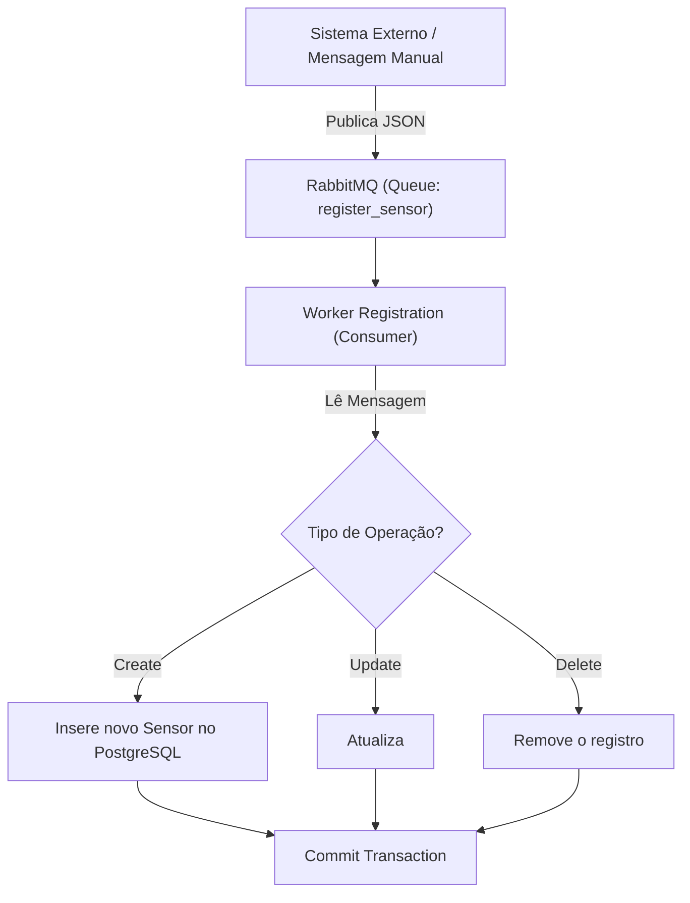
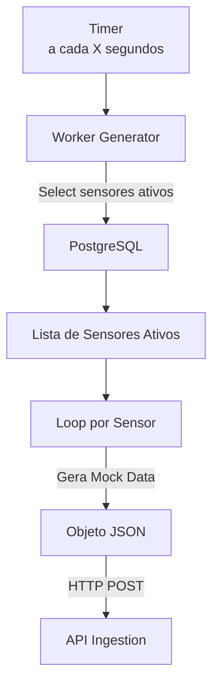

# 🚀 Agrosolutions Worker Sensors

`agrosolutions-worker-sensors` é uma solução contendo microsserviços (Workers) que rodam em background para gerenciamento do ciclo de vida dos sensores e simulação de telemetria.

# 🎯 Objetivos

 - Gerenciar o cadastro, atualização e remoção lógica de sensores no banco de dados.
 - Simular o comportamento de dispositivos IoT no campo, gerando dados realistas.
 - Garantir a consistência dos metadados dos sensores 

# 📃 Funcionalidades principais:

 - **Worker de Cadastro (Registration)**: Consome a fila `register_sensor` do RabbitMQ e executa operações de CRUD no PostgreSQL. Trata criação, atualização e "soft delete" de sensores.
 - **Worker Gerador (Generator)**: Serviço executado periodicamente (Timer) que varre sensores ativos no banco e envia dados simulados.
 - **Gestão de Tipos**: Suporte a sensores do tipo Solo, Silo e Meteorológica.

# 🗃️ Estrutura do Banco de Dados

O worker de cadastro gerencia a tabela principal de sensores via EF Core Migrations.

## 📡 Tabela de Sensors

| Coluna | Tipo | Descrição |
| :--- | :--- | :--- |
| Id | UUID PRIMARY KEY | ID único do sensor (Guid). |
| FieldId | UUID | ID do talhão ao qual o sensor pertence. |
| TypeSensor | INT (Enum) | Tipo do sensor (1=Solo, 2=Silo, 3=Meteorologica). |
| StatusSensor | BOOLEAN | Indica se o sensor está ativo. |
| DtCreated | TIMESTAMP | Data de cadastro do sensor. |
| TypeOperation |INT (Enum) | Tipo do operacao (1=Create, 2=Update, 3=Delete).  |

# ⚙️ Dependências

O projeto utiliza as seguintes bibliotecas principais:

 - Microsoft.Extensions.Hosting (BackgroundService)
 - Microsoft.EntityFrameworkCore
 - Npgsql.EntityFrameworkCore.PostgreSQL
 - RabbitMQ.Client
 - Microsoft.Extensions.Http (HttpClient Factory para o Generator)

# 🔄️ Fluxos

## 📝 Fluxo de Cadastro de Sensor

## 📡 Fluxo de Geração de Dados

